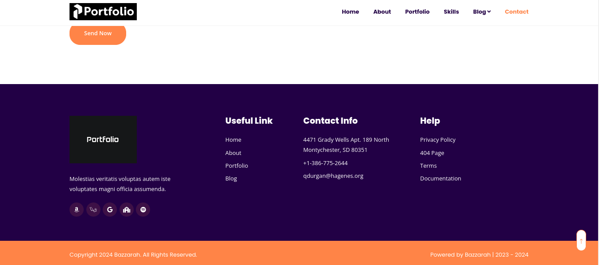
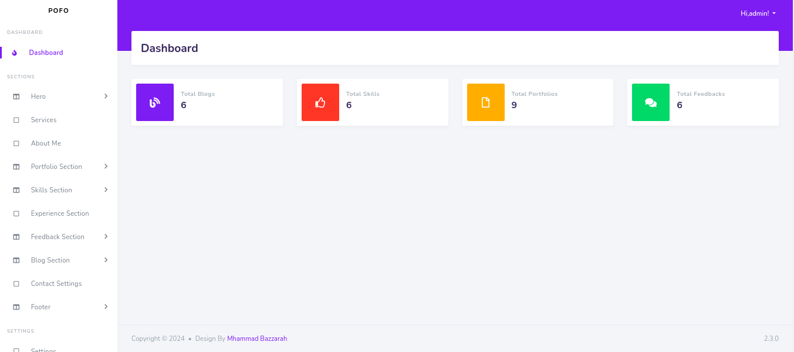

# POFO
Pofo is a portfolio website that you can post your skills,experiences,projects,blogs,customers feedbacks,and contact informations to get hired.
There is also an admin pannel to control all items and settings.

## How to use
```bash
1. git clone <https://github.com/mhammad-bazzarah/POFO.git>
2. composer install
3. cp .env.example .env
4. php artisan key:generate
5. php artisan migrate
6. php artisan serve
7.Go to link localhost:8000
```
## Screenshots





