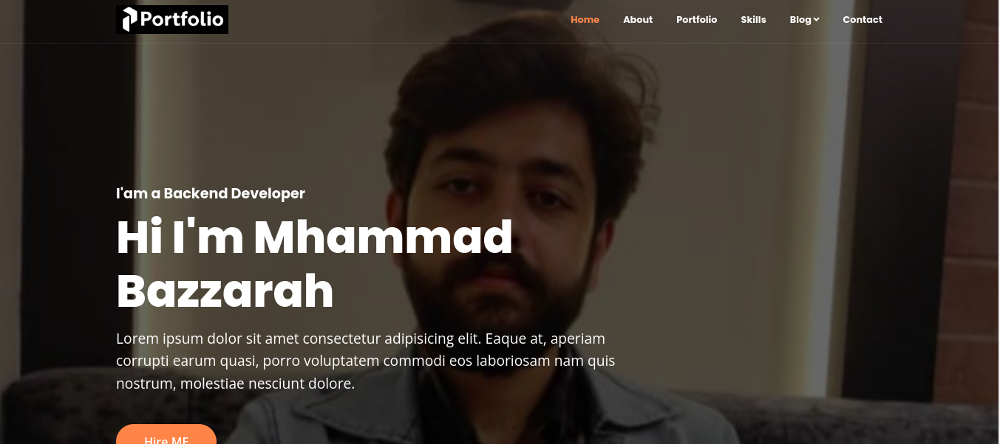

# POFO
Pofo is a portfolio website that you can post your skills,experiences,projects,blogs,customers feedbacks,and contact informations to get hired.
There is also an admin pannel to control all items and settings.

## How to use
1. Run git clone ```bash <https://github.com/mhammad-bazzarah/POFO.git> ``` to clone the repository.
2. Run ```bash composer install ``` to install composer dependency.
3. Copy .env.example To .env and edit the database credential there.
4. Run ```bash php artisan key:generate ``` to generate an app encryption key.
5. Run ```bash php artisan migrate --seed ``` To migrate the database.
6. Run ```bash php artisan db:seed --class=PortfolioSeeder ``` to create dummy portfolio items . 
6. Run ```bash php artisan serve ``` 
7. Go to link localhost:8000
8. Loin to the adminpanel using '/admin' route and use ```bash generalAdmin@port.com ``` and ```bash password ``` to login. 


## Screenshots



